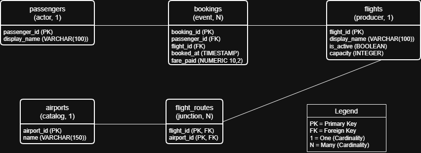

# ex603-airline-booking-database
## Om Pandey
## Airline Booking

A relational database design for an airline booking platform that records passengers, flights, bookings, airports, and flight routes.

## Domain

**Theme: Airline Booking**

This project models an airline booking platform where passengers can book flights and where the system maintains information about available flights and the airports associated with their routes. The database is designed to support both operational booking activity and later analytical queries.

The platform needs to answer questions such as which passengers have made bookings, which flights receive the most bookings, how much fare revenue has been generated, which flights are active, and which airports are associated with particular flights. The design also needs to preserve historical booking information so that past activity can be analyzed even when a flight is no longer active.

## Schema

The database consists of five relations:

* **Passengers** - the actors who make bookings.
* **Flights** - the supply-side entities that passengers can book.
* **Bookings** - the high-volume event table recording booking activity.
* **Airports** - the descriptive catalog of airports.
* **Flight Routes** - the junction relation connecting flights and airports through a many-to-many relationship.

### Entity Relationship Diagram

The schema uses primary keys to provide stable identifiers and foreign keys to maintain valid relationships. Historical bookings are protected from accidental deletion by using restrictive foreign-key behavior, while dependent route records can be removed with their parent flight when appropriate.

## Unit 1 Deliverables

| File                                                         | Purpose                                                  |
| ------------------------------------------------------------ | -------------------------------------------------------- |
| [`schema/schema-definition.md`](schema/schema-definition.md) | Relation schemas, attributes, domains, and primary keys  |
| [`schema/constraints.md`](schema/constraints.md)             | Integrity constraints and foreign-key deletion decisions |
| [`analysis/unit1.md`](analysis/unit1.md)                     | Modelling justification and reflection                   |
| [`schema/erd.png`](schema/erd.png)                           | Entity Relationship Diagram                              |

## Query Catalogue

Query development begins in Unit 3. This section will be expanded as the project progresses.

## Technical Highlights

The design currently focuses on:

* Relational normalization and separation of entity, event, and junction data.
* Stable primary keys for core entities.
* Composite primary keys for many-to-many relationships.
* Foreign keys to protect referential integrity.
* Database-level constraints for invalid capacities and fares.
* Preservation of historical booking data.

## What I Would Do Differently

This section will be expanded as the project develops and additional implementation and query requirements reveal strengths and weaknesses in the initial design.

## Video Presentation

The presentation link will be added in Unit 6.

## How to Run

Database creation and query execution instructions will be added after the PostgreSQL schema is implemented in Unit 2.
