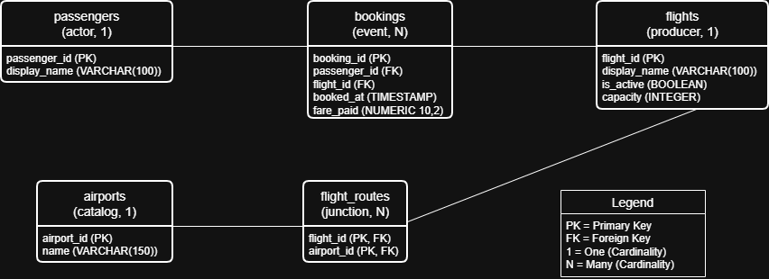

# ex603-airline-booking-database
## Om Pandey
## Airline Booking

A relational database design for an airline booking platform that records passengers, flights, bookings, airports, and flight routes.

## Domain

**Theme: Airline Booking**

This project models an airline booking platform where passengers can book flights and where the system maintains information about available flights and the airports associated with their routes. The database is designed to support both operational booking activity and later analytical queries.

The platform needs to answer questions such as which passengers have made bookings, which flights receive the most bookings, how much fare revenue has been generated, which flights are active, and which airports are associated with particular flights. The design also needs to preserve historical booking information so that past activity can be analyzed even when a flight is no longer active.

## Schema

The database consists of five relations:

* **Passengers** - the actors who make bookings.
* **Flights** - the supply-side entities that passengers can book.
* **Bookings** - the high-volume event table recording booking activity.
* **Airports** - the descriptive catalog of airports.
* **Flight Routes** - the junction relation connecting flights and airports through a many-to-many relationship.

The schema uses primary keys to provide stable identifiers and foreign keys to maintain valid relationships. Historical bookings are protected from accidental deletion by using restrictive foreign-key behavior, while dependent route records can be removed with their parent flight when appropriate.

### Entity Relationship Diagram

## Query Catalogue

Query development begins in Unit 3. This section will be expanded as the project progresses.

## Technical Highlights

The design currently focuses on:

* Relational normalization and separation of entity, event, and junction data.
* Stable primary keys for core entities.
* Composite primary keys for many-to-many relationships.
* Foreign keys to protect referential integrity.
* Database-level constraints for invalid capacities and fares.
* Preservation of historical booking data.

## What I Would Do Differently

This section will be expanded as the project develops and additional implementation and query requirements reveal strengths and weaknesses in the initial design.

## Video Presentation

The presentation link will be added in Unit 6.

## How to Run

To create a database, right click on databases under postgresql under servers, and click create and give the new database a name.

To execute a specific query, highlight any of that query and click the play/execute button, or press the F5 key. To execute the whole script, just click the play/execute button, or press the F5 key.

## Schema

These are the five tables the database models for an airline booking system:

* **`passengers`** - Stores passenger records. Each passenger has a generated integer primary key and a required display name.
* **`airports`** - Stores airport records with a generated integer primary key and required airport name.
* **`flights`** - Stores flight information, including a generated flight ID, display name, active/inactive status, and passenger capacity.
* **`bookings`** - Connects passengers to flights and records when the booking was made and the fare paid. Each booking references one passenger and one flight.
* **`flight_routes`** - Junction table connecting flights and airports. Its composite primary key `(flight_id, airport_id)` prevents the same flight-airport relationship from being recorded more than once.

### Design Decisions

The schema uses PostgreSQL 14+ identity columns (`GENERATED ALWAYS AS IDENTITY`) for surrogate primary keys. Foreign keys are created only after their referenced tables, so the schema can be executed from top to bottom without forward references.

The `bookings` table uses `ON DELETE RESTRICT` for both passengers and flights so that historical booking records cannot be accidentally removed when a referenced passenger or flight is deleted. The `flight_routes.flight_id` relationship uses `ON DELETE CASCADE` because route relationships are dependent on the flight they describe. The airport relationship uses `ON DELETE RESTRICT` to prevent an airport from being removed while it is still referenced by a route.

The `flight_routes` table uses a composite primary key rather than an additional surrogate ID because the combination of a flight and airport uniquely identifies each route relationship.

The schema also uses `CHECK` constraints to prevent invalid data. Flight capacity must be greater than zero, and a booking's `fare_paid` value cannot be negative. Monetary values use `NUMERIC(10,2)` rather than floating-point types to preserve exact decimal precision.
